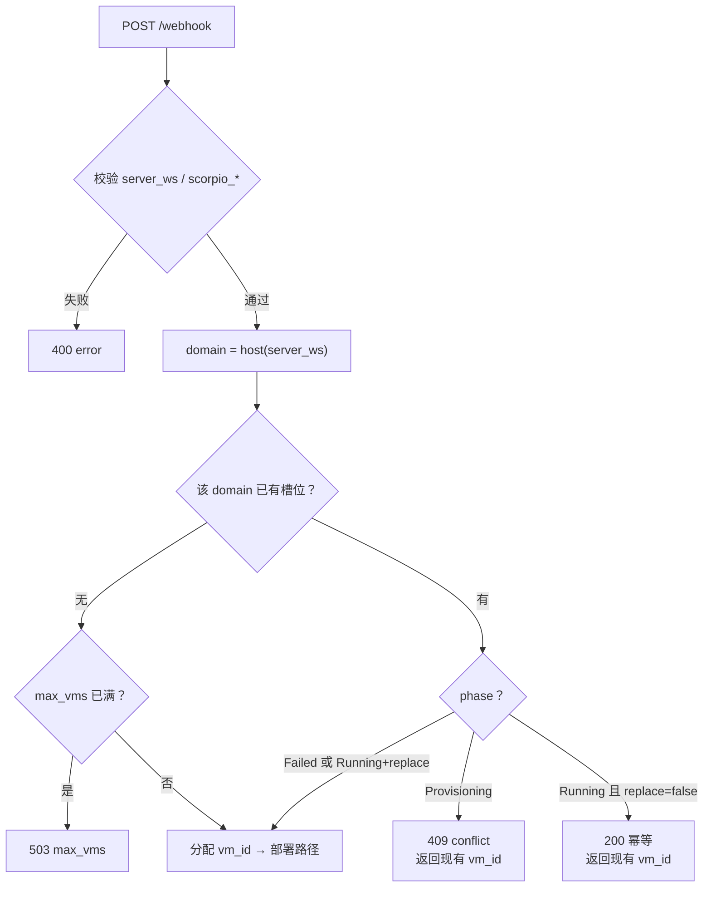
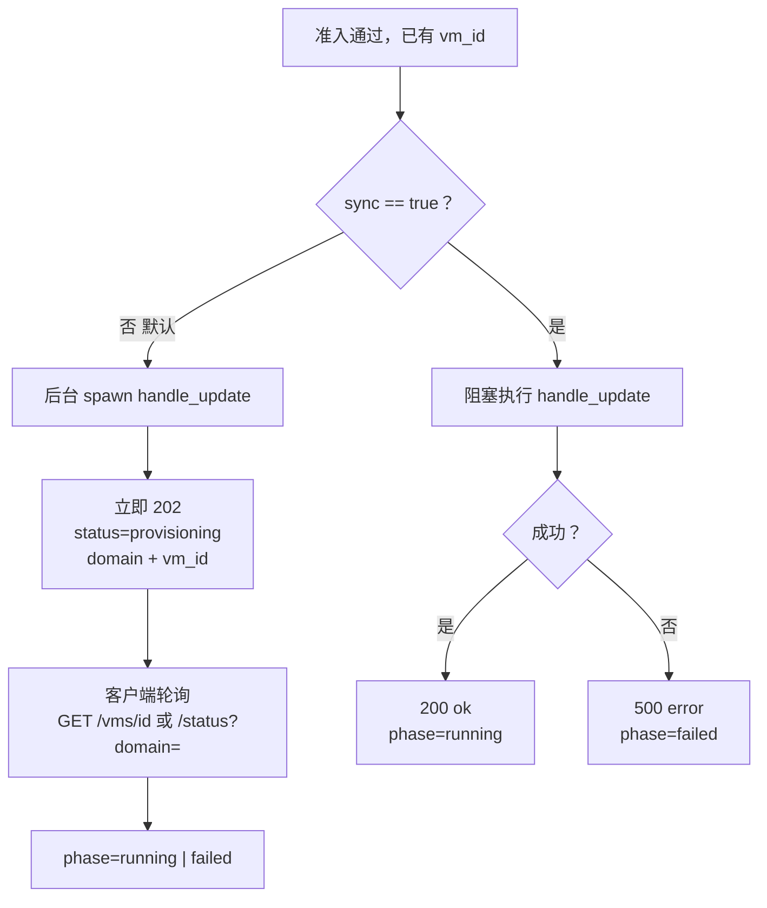
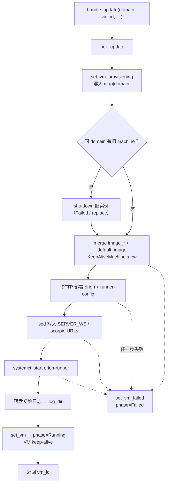

# orion-scheduler 设计文档

## 1. 概述

**目的**：orion-scheduler 是常驻服务，接收 GitHub Actions / mono 代理的 webhook，用 qlean/QEMU/KVM 按 **`server_ws` 主机名（domain）** 管理多台 microVM：注入 Orion 二进制与 runner 配置，并在 keep-alive 模式下保持 VM 运行以支持日志与调试。

**前提条件（AWS EC2 环境）**：

orion-scheduler 依赖 KVM 虚拟化，需在 AWS EC2 实例上启用嵌套虚拟化：

| 条件    | 说明                                 |
| ----- | ---------------------------------- |
| 实例类型  | 支持嵌套虚拟化的类型：`C8i`、`M8i`、`R8i`       |
| 嵌套虚拟化 | 需在实例上启用（新建实例时开启或对现有已停止实例修改 CPU 选项） |
| 操作系统  | 本服务运行在 EC2 实例的 Linux 系统中           |

启用方式：

**AWS 控制台**：

1. 停止目标实例
2. 选择实例 → Actions → Instance settings → Change CPU options
3. 在 "Nested virtualization" 选择 "Enable"
4. 保存后重新启动实例

**AWS CLI**：

```bash
# 新建实例时启用
aws ec2 run-instances --cpu-options "NestedVirtualization=enabled" ...

# 对现有已停止实例启用
aws ec2 stop-instances --instance-id i-xxxxx
aws ec2 modify-instance-cpu-options --instance-id i-xxxxx --nested-virtualization enabled
aws ec2 start-instances --instance-id i-xxxxx
```

**GCP 环境**：（待调查）

**架构**：

```
GHA / mono  --POST /webhook-->  orion-scheduler（单进程）
                                    |
                    +---------------+---------------+
                    |               |               |
                 domain A        domain B        …（最多 max_vms）
                 microVM          microVM
                    |               |
                 SSH/SFTP        SSH/SFTP
              orion + 配置     orion + 配置
```

唯一性 key = `Url::parse(server_ws).host()`。同 domain 冲突策略见 README；进程退出时关闭**全部**跟踪中的 VM，不使用全局 `pkill qemu`。

## 2. 组件

| 组件                  | 描述                                                                                                                   |
| ------------------- | -------------------------------------------------------------------------------------------------------------------- |
| `main.rs`           | axum 入口；`LISTEN_ADDR`；信号时关停全部跟踪 VM + run-dir reap                                                                   |
| `handlers.rs`       | `/webhook`、`/health`、`/status`、`/vms/{id}`、`/logs/...`、`/scorpio/*`、`/shutdown`、`/shutdown/all`                     |
| `state.rs`          | `HashMap<domain, VmEntry>`；全局 `update_lock`；`VmPhase`                                                                |
| `vm_manager.rs`     | VM 部署操作（上传文件、替换环境变量、启动服务）                                                                                            |
| `orion_deployer.rs` | 按 domain 编排部署；`domain_from_server_ws`；仅关同 domain 旧实例                                                                  |
| `config.rs`         | `target_config.json`：路径、`default_image`、可选 `max_vms`                                                                |
| `keep_alive.rs`     | Keep-alive VM 包装器，支持持久化 VM 连接                                                                                        |
| `vm_cleanup.rs`     | 按 `runs/*/qemu.pid` 杀进程与清理死目录（替代宿主机全局 pkill）                                                                         |

## 3. API 端点

### GET /health

健康检查端点。

**响应**：

```json
{"status": "healthy", "service": "orion-scheduler"}
```

### GET /status

列出全部 VM，或按查询过滤。

```bash
curl http://localhost:8080/status
curl 'http://localhost:8080/status?domain=orion.gitmega.com'
curl 'http://localhost:8080/status?vm_id=orion-vm-1234567890'
curl 'http://localhost:8080/vms/orion-vm-1234567890'
```

**列表响应**：

```json
{
  "status": "ok",
  "count": 2,
  "vms": [
    {
      "status": "running",
      "phase": "running",
      "vm_id": "orion-vm-1234567890",
      "domain": "orion.gitmega.com",
      "target": "webhook",
      "vm_ip": "192.168.221.87",
      "uptime_secs": 60,
      "log_file": "/var/log/orion-scheduler/orion-vm-1234567890-….log",
      "error": null
    }
  ]
}
```

无过滤且空列表时仍为 `{ "status": "ok", "count": 0, "vms": [] }`。带 `?domain=` / `?vm_id=` 时返回单机对象（或 `phase: no_vm`）。

### GET /vms/{id}

按 `vm_id` 查单台；不存在时 **404** + `{ "phase": "no_vm", ... }`。

### GET /logs/orion/stream

SSE；多 VM 时传 `?domain=` 或 `?vm_id=`。

```bash
curl -N 'http://localhost:8080/logs/orion/stream?domain=orion.gitmega.com'
```

### POST /shutdown

必须指定 `?domain=` 或 `?vm_id=`；全关用 `POST /shutdown/all`。无参数 → **400**。

```bash
curl -X POST 'http://localhost:8080/shutdown?domain=orion.gitmega.com'
curl -X POST http://localhost:8080/shutdown/all
```

**响应**：

```json
{"status": "ok", "message": "VM for domain 'orion.gitmega.com' stopped", "domain": "orion.gitmega.com"}
```

### GET /webhook

Webhook 端点健康检查。

**响应**：

```json
{"status": "ok", "vm_id": null, "error": null, "orion_log_file": null}
```

### POST /webhook

接收更新请求。默认异步：**202** + `status: provisioning`；后台 `handle_update`。`sync: true` 时阻塞至完成并返回 **200**。

**请求体**：

```json
{
  "action": "requested",
  "server_ws": "wss://orion.gitmega.com/ws",
  "scorpio_base_url": "https://git.gitmega.com",
  "scorpio_lfs_url": "https://git.gitmega.com",
  "target": "aws-gitmega",
  "sync": false,
  "replace": false,
  "image_path": "/path/to/image.qcow2",
  "image_digest": "sha256:abcd1234...",
  "image_disk_gb": 20,
  "image_cpus": 4,
  "image_memory_mb": 8192
}
```

| 字段 | 类型 | 必填 | 描述 |
| --- | --- | --- | --- |
| `action` | string | 否 | GitHub Actions 事件类型，仅记日志 |
| `server_ws` | string | 是 | Orion WebSocket URL；**host 为 domain 唯一键** |
| `scorpio_base_url` | string | 是 | Scorpio base URL，写入 `scorpio.toml` |
| `scorpio_lfs_url` | string | 是 | Scorpio LFS URL，写入 `scorpio.toml` |
| `target` | string | 否 | 仅作日志 / 展示标签（已废弃查表） |
| `sync` | bool | 否 | `true` 同步阻塞至部署完成（默认 `false` → 202） |
| `replace` | bool | 否 | 同 domain 已 Running 时强制重建（默认幂等 200） |
| `image_path` | string | 否 | 本地 qcow2 镜像路径，与 `image_url` 互斥；未指定时使用 `default_image` |
| `image_url` | string | 否 | 远程 HTTPS 镜像 URL，与 `image_path` 互斥 |
| `image_digest` | string | 否* | SHA256/SHA512 hash。`image_path` 或 `image_url` 存在时必填 |
| `image_disk_gb` | u32 | 否 | VM 磁盘大小（GB），未指定时使用 `default_image` |
| `image_cpus` | u32 | 否 | vCPU 数，未指定时使用 `default_image` |
| `image_memory_mb` | u32 | 否 | 内存 MB，未指定时使用 `default_image` |

> **约束**：`image_path` 和 `image_url` 互斥。提供了两者之一时 `image_digest` 必须提供。未传任何 `image_*` 时用 `default_image`（字段级 merge）。达 `max_vms` 且新 domain 时 **503**。

**同 domain 响应**：

| 情况 | HTTP | `status` |
|------|------|----------|
| 新建（异步） | 202 | `provisioning` |
| 新建（sync） | 200 | `ok` |
| 已 Running 且未 `replace` | 200 | `ok`（幂等，返回现有 `vm_id`） |
| 已 Provisioning | 409 | `conflict` |
| `max_vms` 已满（新 domain） | 503 | `error` |

```json
{
  "status": "provisioning",
  "vm_id": "orion-vm-1234567890",
  "domain": "orion.gitmega.com",
  "phase": "provisioning",
  "error": null,
  "orion_log_file": null
}
```

## 4. 核心逻辑

### 4.1 状态管理

```rust
use crate::config::SharedConfig;
use crate::keep_alive::KeepAliveMachine;

pub enum VmPhase {
    Provisioning,
    Running,
    Failed,
}

pub struct VmInfo {
    pub id: String,
    pub domain: String,   // server_ws host；同 domain 唯一
    pub target: String,   // 展示用标签
    pub phase: VmPhase,
    pub ip: Option<String>,
    pub created_at: std::time::Instant,
    pub log_file: Option<String>,
    pub error: Option<String>,
}

pub struct VmEntry {
    pub info: VmInfo,
    pub machine: Option<KeepAliveMachine>,
}

pub struct AppState {
    /// key = domain（server_ws 主机名）
    vms: Arc<RwLock<HashMap<String, VmEntry>>>,
    pub config: SharedConfig,  // 含 default_image、可选 max_vms
    /// 粗粒度 single-flight：创建 / shutdown 与信号关停共用，避免孤儿 qemu
    update_lock: Arc<Mutex<()>>,
}
```

**按域名多 VM**：不同 `server_ws` host 可同时 running；同 domain 冲突策略见 README。Keep-alive 下可通过 `GET /logs/orion/stream?domain=` 拉日志。

### 4.2 生命周期

整体分两段：**准入（HTTP 线程）** → **部署（`handle_update`，可后台）**。不同 domain 的 VM 独立并存；同 domain 最多一台。

#### 4.2.1 准入与冲突（`POST /webhook`）



#### 4.2.2 同步 / 异步分流



#### 4.2.3 单 domain 部署（`handle_update`）

持 `update_lock`；**只**动当前 `domain`，其它 domain 的 VM 不受影响。



完成后客户端可用 `GET /logs/orion/stream?domain=`（或 `?vm_id=`）拉实时日志；关停用 `POST /shutdown?domain=`，进程退出时关**全部**跟踪中的 VM。

### 4.3 详细步骤

| 阶段       | 步骤  | 操作            | 说明                                                                                 |
| -------- | --- | ------------- | ---------------------------------------------------------------------------------- |
| **接收请求** | 1   | 接收 webhook    | 解析 `server_ws` → domain；冲突/幂等/`max_vms` 检查；异步则先 202 |
| **清理**   | 2   | 清理同 domain 旧 VM | 仅对该 domain 调用 `shutdown`（其它 domain 不动）                                                |
| **创建**   | 3   | 构造 ImageConfig  | 根据 webhook 镜像参数构造 `qlean::ImageConfig`；`KeepAliveMachine::new()` 创建 VM |
| **部署**   | 4   | 创建目录          | 在 VM 内创建 `/home/orion/orion-runner/` 目录                                            |
|          | 5   | 上传配置文件        | 通过 SFTP 上传 `run.sh`、`scorpio.toml`、`preflight.sh`、`cleanup.sh`                     |
|          | 6   | 上传 .env 文件    | 上传 `.env.prod` 重命名为 `.env`                                                         |
|          | 7   | 上传 systemd 服务 | 上传 `orion-runner.service` 到 `/etc/systemd/system/`                                 |
|          | 8   | 上传 Orion 二进制  | 通过 SFTP 上传 orion 二进制文件（~500MB）                                                     |
|          | 9   | 设置权限          | `chmod +x` 对脚本和二进制，设置 `setcap cap_dac_read_search+ep`                              |
|          | 10  | 重载 systemd    | 执行 `systemctl daemon-reload`                                                       |
| **配置**   | 11  | 替换环境变量        | 使用 `sed` 替换 `.env` 中的 `SERVER_WS` 和 `scorpio.toml` 中的 `base_url`、`lfs_url`         |
| **启动**   | 12  | 创建 Scorpio 目录 | 创建 `/data/scorpio/store`、`/data/scorpio/antares/{upper,cl,mnt}`、`/workspace/mount` |
|          | 13  | 设置目录所有权       | `chown -R orion:orion /data/scorpio` 和 `/workspace/mount`                          |
|          | 14  | 启动服务          | `systemctl start orion-runner`                                                     |
|          | 15  | 验证状态          | 检查 `systemctl is-active orion-runner` 和进程状态                                        |
| **完成**   | 16  | 保存日志          | 将初始日志写入 `log_dir` 目录                                                               |
|          | 17  | 保持运行          | VM 保持运行，`orion_log_file` 返回日志文件路径                                                  |

## 5. 功能

### 5.1 环境变量替换

#### 背景

在 GitHub Actions 中，不同环境对应不同的 `server_ws` 与 scorpio URL。orion-scheduler 不再通过 `targets` 查表；调用方（GHA、Mega UI 经 mono 代理）在 webhook 请求体中内联传入这三个 URL。

#### 配置文件格式

通过 `CONFIG_PATH` 环境变量指定配置文件路径（默认为 `target_config.json`）：

```json
{
  "log_dir": "/var/log/orion-scheduler",
  "orion_source_dir": "/path/to/mega/orion",
  "orion_binary_path": "/path/to/mega/target/debug/orion",
  "ssh_public_key_path": "~/.ssh/orion_vm_access.pub",
  "max_vms": 8,
  "default_image": {
    "image_path": "~/.local/share/qlean/images/debian-13-buck2/debian-13-buck2.qcow2",
    "image_digest": "sha256:753c28888c9d30fe4baef55c1d1dfa9a39431595eca940b7ad85d78d84f3d7a5",
    "image_disk_gb": 50,
    "image_cpus": 8,
    "image_memory_mb": 16000
  }
}
```

**配置说明**：

| 字段                              | 类型      | 默认                          | 说明                                          |
| ------------------------------- | ------- | --------------------------- | ------------------------------------------- |
| `log_dir`                       | string  | `/var/log/orion-scheduler`  | Orion 日志目录                                     |
| `orion_source_dir`              | string  | 无默认值（必填）                | Orion 源码目录（含 runner-config、systemd）         |
| `orion_binary_path`             | string  | 无默认值（必填）                | Orion 二进制文件路径                               |
| `ssh_public_key_path`           | string  | 无默认值（必填）                | SSH 公钥路径                                    |
| `max_vms`                       | u32     | 无（不限制）                  | 同时跟踪的 VM 上限（按 domain）；新域超出 → 503            |
| `default_image`                 | object  | 见模板                         | 默认 VM 镜像五参数；webhook 未传 `image_*` 时使用        |
| `default_image.image_path`      | string  | —                           | 本地 qcow2 路径                                  |
| `default_image.image_digest`    | string  | —                           | SHA256 校验和                                   |
| `default_image.image_disk_gb`   | u32     | 50                          | 磁盘 GB（长生命周期 VM 建议 ≥50；已部署的 `/etc/.../target_config.json` 需人工改） |

| `default_image.image_cpus`      | u32     | 8                           | vCPU 数                                      |
| `default_image.image_memory_mb` | u32     | 16000                       | 内存 MB                                       |

#### Mega UI URL 推导

Mega UI 调用 `POST /api/v1/orion/runners` 时不传 env URL；mono 从 `build.runner_connect_domain` 推导：

| 字段 | 推导规则 |
| --- | --- |
| `scorpio_base_url` / `scorpio_lfs_url` | `https://git.{runner_connect_domain}`（公网域名默认 TLS；`.test`/`.local`/`localhost` 用 `http`） |
| `server_ws` | `wss://orion.{runner_connect_domain}/ws`（同上） |

示例：`runner_connect_domain = "gitmega.com"` → git `https://git.gitmega.com`，orion `wss://orion.gitmega.com/ws`。

#### GHA 迁移

旧版通过 `target` 名称查 `targets` 表获取 env URL，该机制已移除。GHA workflow 需改为在 webhook 请求体中显式传入 `server_ws`、`scorpio_base_url`、`scorpio_lfs_url`。`target` 仍可选，仅用于日志。

#### 自定义镜像

orion-scheduler 通过 webhook API 的镜像参数来指定 VM 启动镜像（API 是镜像配置的唯一事实来源），支持本地路径和远程 HTTPS URL 两种来源。

**1. 构建自定义镜像**

```bash
# 运行镜像构建脚本（需要 root 权限和 KVM）
sudo ./orion-scheduler/scripts/build-custom-image.sh
```

构建产物：

```
~/.local/share/qlean/images/debian-13-buck2/
├── debian-13-buck2.qcow2   # 自定义镜像（含 buck2）
├── vmlinuz-6.12.85+deb13-amd64
├── initrd.img-6.12.85+deb13-amd64
└── checksums
```

**2. 通过 webhook API 指定镜像**

镜像配置通过 POST `/webhook` 请求体传入：

```json
{
  "server_ws": "wss://orion.gitmega.com/ws",
  "scorpio_base_url": "https://git.gitmega.com",
  "scorpio_lfs_url": "https://git.gitmega.com",
  "image_path": "~/.local/share/qlean/images/debian-13-buck2/debian-13-buck2.qcow2",
  "image_digest": "sha256:abcd1234...",
  "image_disk_gb": 20,
  "image_cpus": 4,
  "image_memory_mb": 8192
}
```

或使用远程 URL：

```json
{
  "server_ws": "wss://orion.gitmega.com/ws",
  "scorpio_base_url": "https://git.gitmega.com",
  "scorpio_lfs_url": "https://git.gitmega.com",
  "image_url": "https://artifacts.company.com/images/buck2-custom.qcow2",
  "image_digest": "sha256:efgh5678...",
  "image_disk_gb": 20
}
```

**约束**：
- `image_path` 和 `image_url` 互斥，不能同时设置
- 提供了 `image_path` 或 `image_url` 时必须同时提供 `image_digest`（格式 `sha256:...` 或 `sha512:...`）
- 资源参数（`image_disk_gb`、`image_cpus`、`image_memory_mb`）可选，不提供时使用 `default_image` 默认值
- 不提供任何镜像参数时，使用 `default_image` 配置块

#### 实现方式

在 `vm_manager.rs` 中通过 SSH 在 VM 内执行 `sed` 命令：

```rust
pub async fn replace_env_vars(
    machine: &mut Machine,
    target_config: &TargetConfig,
    target_name: &str,
) -> Result<()> {
    let server_ws = &target_config.server_ws;
    let scorpio_base_url = &target_config.scorpio_base_url;
    let scorpio_lfs_url = &target_config.scorpio_lfs_url;

    // 替换 .env 中的 SERVER_WS
    let cmd = format!(
        r#"sed -i 's|^SERVER_WS=.*|SERVER_WS="{}"|' /home/orion/orion-runner/.env"#,
        server_ws
    );
    machine.exec(&cmd).await?;

    // 替换 scorpio.toml 中的 base_url（任意值替换为配置的值）
    let cmd = format!(
        r#"sed -i 's|base_url = ".*"|base_url = "{}"|' /home/orion/orion-runner/scorpio.toml"#,
        scorpio_base_url
    );
    machine.exec(&cmd).await?;

    // 替换 scorpio.toml 中的 lfs_url（任意值替换为配置的值）
    let cmd = format!(
        r#"sed -i 's|lfs_url = ".*"|lfs_url = "{}"|' /home/orion/orion-runner/scorpio.toml"#,
        scorpio_lfs_url
    );
    machine.exec(&cmd).await?;

    tracing::info!("[env] Replaced env vars for target: {}", target_name);
    Ok(())
}
```

### 5.2 日志输出

Orion 启动时，将以下信息输出到服务端日志：

| 阶段   | 日志内容                                                                   |
| ---- | ---------------------------------------------------------------------- |
| 目录创建 | `Creating directory: /data/scorpio/store`                              |
| 文件上传 | `Uploading file: orion (~500MB)`                                       |
| 权限设置 | `Setting permissions on /home/orion/orion-runner/orion`                |
| 服务启动 | `Starting Orion service: systemctl start orion-runner`                 |
| 启动结果 | `Orion service started successfully` 或 `Orion service failed: <error>` |
| 健康检查 | `Orion health check: systemctl is-active orion-runner`                 |

日志格式：

```rust
tracing::info!("[orion-deploy] Creating directory: {}", path);
tracing::info!("[orion-deploy] Uploading file: {} -> {}", local, remote);
tracing::info!("[orion-deploy] Setting permissions: {}", path);
tracing::info!("[orion-deploy] Starting Orion service");
tracing::info!("[orion-deploy] Orion started successfully");
tracing::error!("[orion-deploy] Orion start failed: {}", error);
```

## 6. 配置文件

| 来源                     | 目标                                         | 作用描述                                                                                      |
| ---------------------- | ------------------------------------------ | ----------------------------------------------------------------------------------------- |
| `scorpio.toml`         | `/home/orion/orion-runner/scorpio.toml`    | Scorpio FUSE 文件系统配置，定义 Mega 服务地址、store_path、workspace 挂载点、Dicfuse 和 Antares overlay 的行为参数 |
| `.env.prod`            | `/home/orion/orion-runner/.env`            | Orion 运行时的环境变量，包括 `SERVER_WS`（WebSocket 服务器地址）、`BUCK_PROJECT_ROOT`（Buck 项目路径）等            |
| `run.sh`               | `/home/orion/orion-runner/run.sh`          | Orion 启动脚本，加载 `.env` 环境变量，执行 `preflight.sh` 前置检查，然后启动 orion 进程                            |
| `preflight.sh`         | `/home/orion/orion-runner/preflight.sh`    | 前置检查脚本，验证 FUSE 能力和设备访问权限，确保环境满足 Orion 运行要求                                                |
| `cleanup.sh`           | `/home/orion/orion-runner/cleanup.sh`      | 启动前杀旧进程、卸 FUSE、清理孤儿 Antares upper/cl、轮转 orion.log、磁盘水位告警 |
| `orion-runner.service` | `/etc/systemd/system/orion-runner.service` | systemd 服务单元定义，负责配置 Orion 服务的启动参数、运行环境、权限和能力、停止超时等                                        |
| `orion`                | `/home/orion/orion-runner/orion`           | Orion 主程序二进制文件，Buck 构建任务的 WebSocket 客户端，接收并执行构建任务                                         |

### 6.1 Guest 磁盘水位（防打满）

长生命周期 VM 上 Antares `upper/`/`cl/` 与 `orion.log` 会占满默认盘，导致 WS 心跳失败、worker 被标 Lost。

| 机制 | 行为 |
|------|------|
| 构建结束 umount | 默认删除对应 `upper_dir` / `cl_dir`（`ORION_RETAIN_ANTARES_MOUNTS=1` 时保留） |
| `cleanup.sh` | 无活跃挂载时 prune 孤儿 overlay；`orion.log` > 200MB 轮转 |
| Orion 接 `TaskBuild` | `df /` ≥ `ORION_DISK_REJECT_PCT`（默认 92）则拒绝任务并尝试 prune；心跳继续 |
| 默认盘 | `image_disk_gb` 默认 **50**（已有 `/etc/orion-scheduler/target_config.json` 需手动改） |

排障：`GET /scorpio/status?domain=` 响应中的 `disk.df_root` / `disk.du`。

## 7. 部署与运行

### 7.1 资源回收

#### 优雅关闭流程

当服务收到 SIGTERM / SIGINT / SIGQUIT 时：

```
1. 收到终止信号
2. 短超时获取 update_lock（失败仍继续）
3. take_all_machines()：对每个已跟踪 VM 调用 machine.shutdown()
4. reap_qemu_from_runs()：按 runs/*/qemu.pid 杀本数据树下残留 qemu
   （不做宿主机全局 pkill -f qemu-system-x86，避免误伤其它 domain / 其它进程）
5. sweep_stale_runs()：删除 qemu 已退出的 run 目录（overlay/seed 可至数 GB）
6. 退出进程
```

HTTP `POST /shutdown?domain=` 只关一台；`POST /shutdown/all` 关全部跟踪 VM，服务继续监听。

#### 实现要点

- 关停与 webhook 创建共用 `AppState::lock_update` / `try_lock_update`，避免在 `KeepAliveMachine::new` 与 `set_vm` 之间留下孤儿 qemu。
- 启动时同样执行 `reap_qemu_from_runs` + `sweep_stale_runs`，清理上次 SIGKILL/崩溃留下的进程与磁盘。

#### 异常情况处理

| 场景      | 处理方式                       |
| ------- | -------------------------- |
| VM 关闭超时 | KeepAlive / qlean 内部 stop；外加 run-dir pid 再杀 |
| 残留 qemu | 仅杀本 `XDG_DATA_HOME` 下 runs 登记的 pid |
| 文件锁 / 大 overlay | `sweep_stale_runs` 回收死目录 |
| HTTP 误关全部 | `/shutdown` 禁止无参数；需显式 `/shutdown/all` |

### 7.2 运行服务

```bash
# 构建
cargo build --release -p orion-scheduler

# 运行（需要 KVM；工作目录能找到 target_config.json，或设 CONFIG_PATH）
CONFIG_PATH=./orion-scheduler/target_config.json \
  cargo run -p orion-scheduler

# 可选：改监听地址
LISTEN_ADDR=127.0.0.1:8081 cargo run -p orion-scheduler

# 查看日志
RUST_LOG=debug cargo run -p orion-scheduler 2>&1 | grep -E '\[orion|webhook|vm|domain'
```

## 8. 限制和未来工作

- **状态持久化**：VM 状态仅在内存；进程重启后 map 清空（磁盘上的 qemu 靠启动 reap）
- **安全**：没有 webhook 签名验证（生产建议经 mono 内网 + Bearer）
- **并发锁**：`update_lock` 目前全局；不同 domain 创建仍串行，后续可改 per-domain Mutex
- **多 VM**：已按 domain 唯一并存；可选 `max_vms`；不默认支持同机多 scheduler 进程（可用 `LISTEN_ADDR` + `XDG_DATA_HOME` 运维隔离）
- **日志持久化**：初始日志落盘；SSE 从 journalctl / orion.log 读
- **Orion 二进制分发**：仍靠本地 `orion_binary_path`；未来 S3 / Releases 拉取见 ARTIFACT.md
