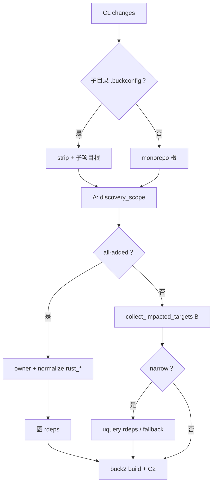
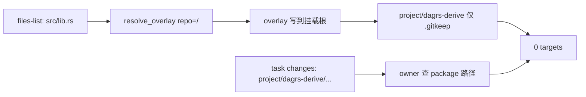

# Target Discovery / CL Overlay 问题归档

本文分两块，互不混写：

1. **Part I — 发现范围（方案 A–E）**：incremental discovery 扫太大 / 拉无关 toolchain / all-added 爆炸（历史，已基本落地）。
2. **Part II — Antares CL overlay（方案 G）**：`repo=/` 时 overlay 路径错位 → 0 target（2026-07，已落地 0.1.3）。

涉及代码均在 `orion` crate（worker）。开放项见文末。

---

# Part I — 发现范围过大（方案 A–E）

## 问题是什么

Buck2 增量构建时，纯 Rust 改动（如 `rk8s`）曾拉起无关 JVM/Android toolchain，或扫入整个 `third-party/**`，导致失败或耗时过长。

> 澄清：`project/buck2_test/toolchains:jdk_*` 等只是 helper 的**定义位置**；被拉入是因为默认 platform + 未过滤 toolchain 传播，不是业务依赖 Java/Android。

## 进展（已落地）

| 方案 | 内容 | 状态 |
|------|------|------|
| **A** | 按改动路径收窄 `buck2 targets`（`discovery_scope.rs`；`ORION_DISCOVERY_SCOPE=0` 可关） | 已落地 |
| **B** | 过滤 toolchain/platform helper 的传播与 build 选集 | 已落地 |
| **C1/C2** | 去掉 CLI `--target-platforms`；`platform.rs` 注入 `--config` | 已落地 |
| **D** | narrow：`uquery rdeps`（失败则图 rdeps）；all-added 子项目：仅图 rdeps | 部分落地 |
| **子项目根** | `detect_subproject_buck_root()`，从 `rk8s/` 等跑 buck2 | 已落地 |
| **E / All-added** | 跳过空 base `SelectAll`；`owner()` + `normalize_owner_targets_to_rust` + 图 rdeps | 已落地 |

**验证（CL `UYXIYYNJ` / rk8s 全量导入）**：Build **#45**（`019ef333…`）discovery 28× `rust_*`，约 23k action / ~73 min，exit 0 真编译。中间失败（SelectAll 爆炸、`:vendor` 浅成功、FUSE ENOENT 等）从略。

## 根因与对策（精简）

worker：`get_build_targets()` → 图 diff / `owner()` → `buck2 build`。

| 问题 | 表现 | 对策 |
|------|------|------|
| 扫全 cell | `root//...` 带入无关树 | **A** |
| toolchain 传播 | 默认 platform 拉 JVM/Android helper | **B** + **C2** |
| all-added 空 base | `SelectAll` → 数万 action | **E**：`owner()` + 限 `project/` + rust 归一化 + 图 rdeps |
| owner → `:vendor` | 无 `rustc` | `normalize_owner_targets_to_rust` |
| 子项目 `.buckconfig` | 从 monorepo 根跑 buck2 失败 | `detect_subproject_buck_root()` |

### Discovery 流程

上图假定挂载上的源码路径已正确；路径错位见 Part II。

## Part I 代码索引

| 文件 | 内容 |
|------|------|
| [buck_controller.rs](../src/buck_controller.rs) | discovery、B、all-added、owner 归一化、图 rdeps |
| [discovery_scope.rs](../buck/discovery_scope.rs) | 方案 A、子项目检测 |
| [platform.rs](../buck/platform.rs) | C2 `--config` |
| [diff.rs](../src/repo/diff.rs) | `EmptyBasePolicy`、图 rdeps |
| [run.rs](../buck/run.rs) | `uquery_rdeps`、`owners` |
| [FUSE_MOUNT_ISSUES.md](./FUSE_MOUNT_ISSUES.md) | FUSE / ENOENT（#45 相关） |

| 变量 | 默认 | 作用 |
|------|------|------|
| `ORION_DISCOVERY_SCOPE` | 开 | 关方案 A |
| `ORION_BUCK_REMOTE_CACHE` | 关 | `1` 允许读 remote cache |

---

# Part II — Antares CL overlay 路径错位（方案 G）

与 Part I 无关：discovery 算法可正确，但 **CL 文件没铺到 monorepo 对应路径**，`owner()` / `buck2 targets` 仍看到空 package → 0 target。

## 现象

CL [LADRHWDL](https://app.rk8s.xuanwu.openatom.cn/mega/cl/LADRHWDL)（CL 路径 `/project/dagrs-derive`，task `repo=/`）：

- Mega task `changes` 已是 `project/dagrs-derive/src/lib.rs` 等。
- Orion：`owner() returned no build targets` → `0 targets` → 跳过 build、exit 0。
- Overlay：`applied_files=["BUCK","src/lib.rs",…]`（**缺少** `project/dagrs-derive/`）。

## 根因

1. Mega `files-list` 路径相对 **CL 目录**。
2. Task `changes` 相对 **Buck 根**（Mega 已 rebase）。
3. 旧 Antares 在 `repo=/` 时原样用 CL 相对路径 → 文件在挂载根，package 无 BUCK。
4. discovery 查 `project/dagrs-derive/...` → 无 owner / 无 `rust_*`。

VM：文件放到正确路径后，`owner(…/src/lib.rs)` → `:vendor`，`targets //project/dagrs-derive:` 含 `dagrs_derive`。

## 修复（已落地，orion `0.1.3`）

| 点 | 行为 |
|----|------|
| `rebase_cl_relative_path` | 与 Mega 同语义：CL 为 repo 子目录时拼前缀 |
| `infer_cl_path_from_changes` | 仅 `repo` 为空/`/`：changes 最长公共目录前缀 |
| `resolve_overlay_relative_path` | 先 rebase，再 repo-prefix / 安全检查 |
| 接线 | CL mount 传 `cl_path`；old mount 不传 |

落点：[antares.rs](../src/antares.rs)、[buck_controller.rs](../src/buck_controller.rs)（`mount_antares_fs`）。

部署后 Retry：`applied_files` 应含 `project/dagrs-derive/...`；discovery 非 0。

**不做**方案 F（heuristic vendor / Added-BUCK fallback）：overlay 修对后 `owner(src/…)` 已够用。

## Part II 代码索引

| 文件 | 内容 |
|------|------|
| [antares.rs](../src/antares.rs) | `rebase` / `infer_cl_path` / populate |
| [buck_controller.rs](../src/buck_controller.rs) | CL mount 传入推断的 `cl_path` |

---

# 开放项（跨 Part）

| 项 | 说明 |
|----|------|
| **0 target 仍 exit 0** | `finish_without_build_if_no_targets()` 掩盖 discovery / overlay 失败 |

---

## 修订历史

| 日期 | 说明 |
|------|------|
| 2026-06-15～23 | Part I：方案 A–E；UYXIYYNJ #45 |
| 2026-07-24 | Part II：方案 G（LADRHWDL overlay 路径）；文档拆成发现范围 vs overlay 两块 |
