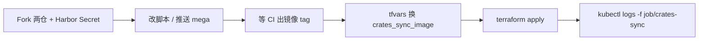

# Crates Sync 上手指南（架构 + 脚本 + Terraform）

面向**不熟悉当前系统**的同学：搞清「要导入什么、数据在哪、怎么本地试、怎么用 Terraform 在 k3s-rust 上跑 Job、怎么看进度/排错」。集群部署测试需 **fork mega + mega-terraform**，在 mega 配 Harbor Secret，等 CI 出镜像后改 tf 的 image tag 并 `terraform apply`（详见 §3）。

---

## 1. 一句话目标

把 [crates.io](https://crates.io) 上的 crate 源码，按版本导入到 Mega 的 **monorepo 路径仓库**里：

```text
third-party/rust/crates/<crates.io-index 路径>/<version>/
```

例如 `tokio@1.37.0` → `third-party/rust/crates/to/ki/tokio/1.37.0`。

**不要**指望在 Web UI 里对整个 mega 仓库点 Sync 来完成这件事；大规模导入的正确入口是本目录脚本（本地或 K8s Job）。

---

## 2. 系统架构（先建立心智模型）

### 2.1 相关仓库

| 仓库 | 作用 |
|------|------|
| **mega** | 应用与本脚本：`scripts/crates-sync/`；CI 构建 `crates-sync` 镜像 |
| **mega-terraform** | 把栈部署到 K8s；`envs/onprem/k3s-rust` 是 rust 环境 |

### 2.2 rust 环境里有什么（`mega-rust` 命名空间）

```text
用户 / CI
    │
    ▼
┌─────────────────────────────────────────────────────────┐
│  k3s 集群 · namespace: mega-rust                          │
│                                                         │
│  mono-engine (git HTTP)  ←── git push 目标               │
│       git.rust.xuanwu.openatom.cn                       │
│                                                         │
│  mega-ui / campsite-api / …                             │
│                                                         │
│  RustFS (S3)  ←── mono 存 pack/对象（PVC，当前约 50Gi）   │
│                                                         │
│  Job: crates-sync  ──hostPath──► storage-server-01      │
│       │                         /opt/data/freighter/    │
│       │                           ├── crates.io-index   │
│       │                           ├── crates/  (.crate) │
│       │                           └── mega-crates-work/ │
│       └── run_job.py → crates-sync.py                   │
└─────────────────────────────────────────────────────────┘
```

要点：

1. **导入进程**跑在节点 `storage-server-01` 上（有 freighter 磁盘），不是随便一个 worker。
2. **index / .crate 缓存**在宿主机 `/opt/data/freighter`，Job 里挂载为 `/freighter`。Job **只读**这两棵树（不 `git pull`、不往 `crates/` 下载/删除）；更新由 freighter 负责。可写的只有 `mega-crates-work/`（workdir + manifest）。
3. **git push** 打到集群内的 **mono-engine**；对象最终进 **RustFS**。磁盘不够会导致 push/保存失败。
4. 该节点有污点 `observe-only=true:NoSchedule`；Terraform 已给 Job 配了 toleration，否则 Pod 会一直 Pending。

### 2.3 脚本在干什么（流水线）

```text
读 crates.io-index（流式扫文件）
        │ 并行
        ▼
下载 .crate（若缓存没有）→ 解压 → git init/commit → git push → Mega
        │
        ▼
写 manifest（JSONL）：crate@version → ok | skip | fail
```

全量模式下：

- **Producer**：全速扫 index，分母（`versions_found`）涨到真实规模（约 **200 万** version）。
- **Workers（`--jobs`）**：同时从队列取任务做下载/推送。
- 已成功写入 manifest 的 `status=ok` **默认跳过**（可断点续跑）。
- 远端路径上已有历史时，先 `ls-remote` **跳过**下载/推送（进度里算 skip，manifest 写成 `ok`）；要用新提交覆盖需 `--reimport-ok` 且配合 `--force` / `--force-with-lease`。
- 若仍走到 push 且遇到 non-fast-forward，同样按已存在处理，不再反复 fail。

---

## 3. 改代码到集群部署测试（完整流程）

在集群上验证 / 跑 Job，需要同时使用 **两个仓库**，并走完「镜像构建 → 改 tag → terraform apply」。

### 3.0 线上测试流程图



### 3.1 Fork 两个仓库

1. Fork **mega**（脚本、Dockerfile、CI）
2. Fork **mega-terraform**（k3s-rust 环境、`crates_sync` Job 配置）

本地分别 clone 自己的 fork，按团队习惯从 upstream 同步 `main` 后再开分支改动。

### 3.2 在 mega 仓库配置 Harbor Secret

CI workflow：`.github/workflows/crates-sync-deploy.yml`。  
推送镜像到 `registry.xuanwu.openatom.cn/mega/crates-sync`，登录依赖 GitHub Actions Secrets：

| Secret 名称 | 用途 |
|-------------|------|
| `HARBOR_USERNAME` | Harbor 用户名 |
| `HARBOR_PASSWORD` | Harbor 密码 / Robot token |

在 **你的 mega fork** 上配置：

1. GitHub → 仓库 → **Settings** → **Secrets and variables** → **Actions**
2. 新增上述两个 Secret（向有权限的同学索取 Harbor 账号；勿把密码写进代码或 tfvars）
3. 确认 Actions 已启用（fork 上可能要手动允许 workflow）

未配置 Secret 时，CI 会在 Login to Harbor 步骤失败，镜像不会进仓库。

### 3.3 改脚本并等 CI 出镜像

1. 在 mega fork 修改 `scripts/crates-sync/**`（或 workflow 本身）
2. 合并 / 推送到会触发 workflow 的分支（当前 workflow 监听 **`main`**，且仅当上述路径变更时触发）
3. 打开 Actions → **Crates Sync deploy**，等到 **build-and-push 成功**
4. 成功后 Harbor 中会有类似 tag：
   - `registry.xuanwu.openatom.cn/mega/crates-sync:<短 sha>`（commit 前 7 位，**部署请用这个**）
   - `registry.xuanwu.openatom.cn/mega/crates-sync:latest`

从 Actions 日志或 `GITHUB_SHA` 前 7 位确认实际 tag。

### 3.4 在 mega-terraform 中替换 image tag

在 **mega-terraform** fork 的环境文件中更新镜像，例如 `envs/onprem/k3s-rust/terraform.tfvars`：

```hcl
enable_crates_sync              = true
crates_sync_freighter_host_path = "/opt/data/freighter"
crates_sync_node_hostname       = "storage-server-01"
crates_sync_image               = "registry.xuanwu.openatom.cn/mega/crates-sync:<短sha>"

# 部署测试可先限流，确认链路后再去掉：
# crates_sync_args = ["--jobs", "2", "--limit-crates", "20", "--max-versions-per-crate", "1"]
```

`crates_sync_image` 每换一次 tag，Terraform 会 **替换重建** `crates-sync` Job（异步，apply 不等待导入跑完）。

### 3.5 执行 `terraform apply` 部署测试

```bash
cd mega-terraform/envs/onprem/k3s-rust
terraform init    # 首次或 backend/provider 变更后
terraform plan    # 确认会替换 Job / 更新 image-trigger
terraform apply
```

然后跟日志验证：

```bash
kubectl -n mega-rust get pods -l job-name=crates-sync -o wide
kubectl -n mega-rust logs -f job/crates-sync
```

仅本地跑脚本、不发 Job 时，可跳过 Harbor / CI / apply，见 §5。

---

## 4. 代码与关键文件位置

| 路径 | 说明 |
|------|------|
| `mega/scripts/crates-sync/crates-sync.py` | 核心导入逻辑 |
| `mega/scripts/crates-sync/run_job.py` | K8s Job 入口：等 mono、bootstrap token、调 sync |
| `mega/scripts/crates-sync/Dockerfile` | 镜像构建上下文（目录即本目录） |
| `mega/.github/workflows/crates-sync-deploy.yml` | 构建并推送镜像到 Harbor |
| `mega-terraform/modules/.../gitmono_stack/crates_sync.tf` | Job / hostPath / 亲和 / toleration |
| `mega-terraform/envs/onprem/k3s-rust/terraform.tfvars` | 该环境开关与镜像 tag |

英文细节与参数列表见同目录 [README.md](./README.md)。

---

## 5. 本地怎么用脚本（调试推荐）

### 5.1 依赖

- Python 3
- Git
- 一份本地 [crates.io-index](https://github.com/rust-lang/crates.io-index) checkout
- 能访问目标 Mega 的 **Bearer token**（`MEGA_TOKEN` 或 `--token`）

### 5.2 小规模试跑（强烈推荐先做）

只导几个 crate，**不扫全量 index**：

```bash
export MEGA_TOKEN="你的token"

python3 scripts/crates-sync/crates-sync.py \
  --index ~/crates.io-index \
  --crates-dir /tmp/crates-cache \
  --workdir /tmp/mega-crates-work \
  --git-base-url https://git.rust.xuanwu.openatom.cn \
  --token "$MEGA_TOKEN" \
  --crate tokio --crate serde \
  --max-versions-per-crate 1 \
  --jobs 2
```

干跑（只下载解压，不 commit/push）：

```bash
python3 scripts/crates-sync/crates-sync.py \
  --index ~/crates.io-index \
  --crates-dir /tmp/crates-cache \
  --workdir /tmp/mega-crates-work \
  --git-base-url https://git.rust.xuanwu.openatom.cn \
  --crate tokio \
  --max-versions-per-crate 1 \
  --dry-run
```

采样 20 个 crate：

```bash
python3 scripts/crates-sync/crates-sync.py \
  --index ~/crates.io-index \
  --crates-dir /tmp/crates-cache \
  --workdir /tmp/mega-crates-work \
  --git-base-url https://git.rust.xuanwu.openatom.cn \
  --token "$MEGA_TOKEN" \
  --limit-crates 20 \
  --max-versions-per-crate 1 \
  --jobs 4
```

### 5.3 常用参数

| 参数 | 含义 |
|------|------|
| `--jobs N` | 并发 worker 数；同时限制并发 `git push` |
| `--max-versions-per-crate N` | 每 crate 只保留最近 N 个版本；`0` = 全部 |
| `--keep-crate-cache` | 成功后不删 `.crate`（共享 freighter 缓存时必须开） |
| `--readonly-crate-cache` | **只读** `--crates-dir`：不下载、不删、不建目录；缺包/坏包直接失败（由 freighter 更新） |
| `--manifest PATH` | 断点清单；默认 `<workdir>/crates-import-manifest.jsonl` |
| `--reimport-ok` | 强制重导 manifest 里已是 `ok` 的版本 |
| `--force` / `--force-with-lease` | 只影响 git push，**不会**绕过 manifest 的 ok 跳过 |

### 5.4 进度条（本地 / Job 日志底部）

默认开启 sticky heartbeat，大致形如：

```text
progress: [##----------------------------]   0.8%  16000/1850000  push/s=1.20  eta=48.2h
scan: crates=... versions_found=... status=running ...
config: jobs=2 queue_depth=...
counts: ok=... skip=... fail=... done=...
status: downloading=... pushing=...
push: ok_60s=... per_s=1.20 per_min=...
```

说明：

- 扫 index 未完成时，分母会随 `versions_found` **一直涨**（目标约 200 万），不要用早期百分比当「快做完了」。
- 默认约 **2s** 刷新一次 sticky 进度（可用 `--status-interval` 调整）；**不会**每导入一个版本就刷一行。
- `push/s` / `per_s` 为近 60 秒成功 push 速率（`ok_60s / 60`）。
- `[OK] xxx pushed` 仅在 `--verbose` 时打印；平时看底部进度条的 `ok/skip/fail` 计数即可。

---

## 6. 用 Terraform 在 k3s-rust 上跑 Job（细节）

> 端到端步骤见 **§3**。本节补充前置条件与运维细节。

环境目录：`mega-terraform/envs/onprem/k3s-rust`  
命名空间：`mega-rust`  
域名示例：`https://git.rust.xuanwu.openatom.cn`（mono）、`https://app.rust.xuanwu.openatom.cn`（UI）。

### 6.1 前置条件 Checklist

1. 已按 §3 fork 两仓库，mega 已配 Harbor Secret，CI 已产出目标镜像 tag。
2. 能访问集群：`kubeconfig`（如 `~/.kube/k3s.yaml`），`kubectl -n mega-rust get pods` 正常。
3. 节点 `storage-server-01` 存在，且已有目录：
   - `/opt/data/freighter/crates.io-index`（完整 index checkout）
   - `/opt/data/freighter/crates`（.crate 缓存，可空）
4. mono / RustFS 已在该命名空间跑着（Job `depends_on` apps）。

### 6.2 配置要点

```hcl
enable_crates_sync              = true
crates_sync_freighter_host_path = "/opt/data/freighter"
crates_sync_node_hostname       = "storage-server-01"  # 与 kubectl get nodes 主机名一致
crates_sync_image               = "registry.xuanwu.openatom.cn/mega/crates-sync:<短sha>"

# 小流量试跑可加（全量导入时不要限制）:
# crates_sync_args = ["--jobs", "4", "--limit-crates", "20", "--max-versions-per-crate", "1"]

# 全量常见写法（run_job 默认已是 max-versions=0、keep-cache）:
# crates_sync_args = ["--jobs", "4"]
```

说明：

- `run_job.py` 默认：`--jobs 2`、`--max-versions-per-crate 0`、`--keep-crate-cache`、等 mono 就绪后用 `MEGA_INIT_BOOTSTRAP_SECRET` 换 bot token。
- 额外参数通过 `crates_sync_args` 拼到 `run_job.py` 后面。

### 6.3 Apply（异步 Job）

```bash
cd mega-terraform/envs/onprem/k3s-rust
terraform init   # 首次
terraform plan
terraform apply
```

- Job **`wait_for_completion = false`**：apply 成功 ≠ 导入完成，只表示 Job 对象已创建/替换。
- **换镜像 tag** 或改触发 `terraform_data.crates_sync_image` 的内容 → Job **替换重建** → 新一轮导入（manifest 仍在 freighter 盘上，ok 会继续 skip）。

### 6.4 看日志与状态

```bash
kubectl -n mega-rust get job crates-sync
kubectl -n mega-rust get pods -l job-name=crates-sync -o wide
kubectl -n mega-rust logs -f job/crates-sync
```

期望：Pod 在 **`storage-server-01`**，状态 Running。

### 6.5 重新跑一轮

1. mega：等 **Crates Sync deploy** CI 成功，记下新 `<短sha>`。
2. mega-terraform：改 `crates_sync_image`。
3. `terraform apply`。

### 6.6 小流量建议

先用 `crates_sync_args` 加 `--limit-crates` / `--max-versions-per-crate` 通链路，再去掉限流做全量；盯 RustFS PVC 与 freighter 磁盘。

---

## 7. Manifest 与「杀 Job 再跑」行为

- 路径（Job）：`/freighter/mega-crates-work/crates-import-manifest.jsonl`
- `status=ok` → 下次默认 **skip**（省时间、可续跑）。
- `--force` **不会**重导 ok；要重导用 `--reimport-ok`（经 `crates_sync_args` 传入）。
- 杀 Pod/Job **不会**清 freighter 上的 index、crates 缓存、manifest。

---

## 8. 常见问题

全量导入体量大，优先关注资源是否够用：

| 现象 | 可能原因 | 处理 |
|------|----------|------|
| `git push` / S3 报错、对象写失败 | RustFS **磁盘**不足（PVC 写满） | 扩容 PVC（如 `data-rustfs-0`），确认 Longhorn 已 `allowVolumeExpansion`；盯 `kubectl -n mega-rust get pvc` |
| RustFS / mono OOM、请求超时 | RustFS 或 mono **内存**不足 | 调高 `rustfs_resources` / mono 资源后 apply；查对应 Pod 是否被 OOMKilled |
| crates-sync Pod OOMKilled / Evicted | Job **内存/CPU** limit 过紧（全量扫队列也会占内存） | 调高 `crates_sync.tf` 里 container resources，或减小 `--jobs` |
| 节点磁盘打满、下载/解压失败 | freighter 宿主机盘（`/opt/data/freighter`）空间不足 | 清理或扩容 `storage-server-01` 上 freighter 目录所在磁盘 |

---

## 9. 相关链接（按环境替换）

- Git：`https://git.rust.xuanwu.openatom.cn`
- App：`https://app.rust.xuanwu.openatom.cn`
- Harbor：`registry.xuanwu.openatom.cn`（镜像 `mega/crates-sync`）
- Terraform 环境说明：`mega-terraform/envs/onprem/k3s-rust/README.md`
- 脚本英文 README：`scripts/crates-sync/README.md`
